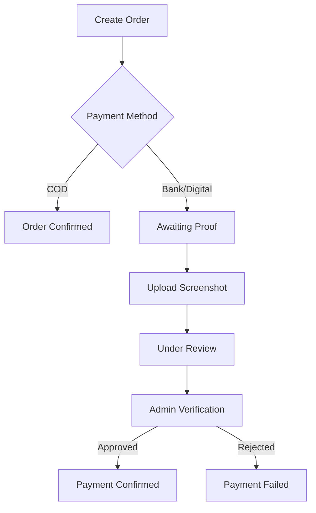

# Soleva E-commerce Backend

> Luxury shoe brand e-commerce platform backend for solevaeg.com

## 🚀 Features

### Core E-commerce
- **Product Catalog**: Comprehensive product management with variants, specifications, and inventory tracking
- **Order Management**: Complete order lifecycle from creation to delivery with timeline tracking
- **Payment Processing**: Support for Cash on Delivery, Bank Wallet, and Digital Wallet with proof upload
- **Shipping System**: Egyptian governorates/centers/villages with dynamic cost calculation
- **User Management**: Customer accounts with addresses, favorites, and order history

### Advanced Features
- **Multi-language Support**: Arabic/English with RTL support
- **File Upload System**: Secure image processing with Sharp and virus scanning
- **Real-time Chat**: AI assistant + live chat with order tracking
- **Email Automation**: Branded email templates for order confirmations and notifications
- **Admin Panel**: Comprehensive admin interface with RBAC and analytics
- **Device Analytics**: Performance tracking and adaptive mode detection

### Security & Performance
- **Authentication**: JWT-based auth with role-based access control
- **Rate Limiting**: API protection with Redis-based rate limiting
- **Input Validation**: Comprehensive validation with Zod schemas
- **Audit Logging**: Complete audit trail for all admin actions
- **Caching**: Redis caching for improved performance
- **Image Optimization**: Automatic WebP conversion and thumbnail generation

## 🛠 Tech Stack

- **Runtime**: Node.js 18+ with TypeScript
- **Framework**: Express.js with modular architecture
- **Database**: PostgreSQL with Prisma ORM
- **Cache**: Redis for sessions and caching
- **Authentication**: JWT with bcrypt password hashing
- **File Storage**: Local storage with S3 support for production
- **Email**: Nodemailer with branded templates
- **Documentation**: Swagger/OpenAPI 3.0
- **Testing**: Jest with comprehensive test coverage
- **Monitoring**: Winston logging with Sentry integration

## 📁 Project Structure

```
backend/
├── src/
│   ├── controllers/          # Request handlers
│   ├── middleware/          # Custom middleware
│   ├── routes/             # API routes
│   ├── services/           # Business logic
│   ├── utils/              # Helper functions
│   ├── types/              # TypeScript types
│   └── server.ts           # App entry point
├── prisma/
│   ├── schema.prisma       # Database schema
│   └── seed.ts            # Database seeding
├── uploads/               # File uploads (development)
├── logs/                 # Application logs
├── Dockerfile            # Container configuration
└── package.json          # Dependencies
```

## 🚦 Getting Started

### Prerequisites

- Node.js 18+
- PostgreSQL 13+
- Redis 6+
- Docker & Docker Compose (recommended)

### Quick Start with Docker

1. **Clone and setup**:
   ```bash
   git clone <repository>
   cd web
   make install
   ```

2. **Configure environment**:
   ```bash
   cp backend/env.example .env
   # Edit .env with your configuration
   ```

3. **Start development environment**:
   ```bash
   make dev
   ```

4. **Access the application**:
   - API: http://localhost:3001
   - Docs: http://localhost:3001/docs
   - Health: http://localhost:3001/health

### Manual Installation

1. **Install dependencies**:
   ```bash
   cd backend
   npm install
   ```

2. **Setup database**:
   ```bash
   npm run migrate:dev
   npm run seed
   ```

3. **Start development server**:
   ```bash
   npm run dev
   ```

## 📊 Database Schema

### Core Entities

- **Users**: Customer and admin accounts with RBAC
- **Products**: Product catalog with variants and specifications
- **Orders**: Complete order management with timeline
- **Addresses**: Egyptian address hierarchy (governorate/center/village)
- **Inventory**: Stock tracking with movement history
- **Payments**: Payment processing with proof upload
- **Shipping**: Dynamic shipping cost calculation
- **CMS**: Content management for pages and blocks
- **Chat**: Conversation and message management
- **Audit**: Complete audit trail for admin actions

### Key Features

- **Multi-language**: JSON fields for Arabic/English content
- **Hierarchical Data**: Categories, addresses, and organizational structure
- **Audit Trail**: Complete change tracking with before/after values
- **Soft Deletes**: Preserve data integrity with status flags
- **Performance**: Optimized indexes for common queries

## 🔐 Authentication & Authorization

### User Roles

- **CUSTOMER**: Basic user with shopping capabilities
- **SUPPORT**: Customer support access
- **CONTENT**: Content management access
- **MANAGER**: Store management access
- **ADMIN**: Full administrative access
- **OWNER**: Complete system access

### JWT Implementation

```typescript
// Token structure
{
  userId: string,
  email: string,
  role: UserRole,
  iat: number,
  exp: number
}
```

### Protected Routes

```typescript
// Middleware usage
router.use('/admin', requireAdmin);
router.use('/orders', authMiddleware);
router.use('/cart', authMiddleware);
```

## 💳 Payment System

### Supported Methods

1. **Cash on Delivery (COD)**
   - No upfront payment required
   - Payment collected on delivery

2. **Bank Wallet Transfer**
   - Customer transfers to bank account
   - Upload payment proof screenshot
   - Admin verification required

3. **Digital Wallet (e.g., Vodafone Cash)**
   - Transfer to digital wallet number
   - Upload payment proof screenshot
   - Admin verification required

### Payment Flow



## 🚚 Shipping System

### Egyptian Address Hierarchy

```
Egypt
├── Governorate (محافظة)
│   ├── Center (مركز)
│   │   ├── Village (قرية)
│   │   ├── Kafr (كفر)
│   │   ├── Ezba (عزبة)
│   │   └── Sheikh (شيخ)
```

### Shipping Cost Calculation

1. **Free Shipping**: Orders > 500 EGP
2. **Governorate-based**: Default cost per governorate
3. **Center Override**: Specific costs for centers
4. **Village Override**: Specific costs for villages

### Implementation

```typescript
const shippingCost = await calculateShippingCost(
  governorate,
  orderTotal,
  center?,
  village?
);
```

## 📧 Email System

### Branded Email Addresses

- **info@solevaeg.com**: General inquiries
- **sales@solevaeg.com**: Order confirmations
- **business@solevaeg.com**: B2B partnerships
- **support@solevaeg.com**: Customer support

### Email Templates

- Order confirmation
- Payment instructions
- Shipping updates
- Delivery confirmation
- Password reset
- Welcome emails

### Configuration

```typescript
// Email service setup
const emailConfig = {
  host: process.env.SMTP_HOST,
  port: process.env.SMTP_PORT,
  secure: true,
  auth: {
    user: process.env.SMTP_USER,
    pass: process.env.SMTP_PASS
  }
};
```

## 📱 Chat System

### Features

- **AI Assistant**: Automated responses for common queries
- **Live Chat**: Real-time support with agents
- **Order Tracking**: Integrated order status checking
- **Multi-language**: Arabic/English support
- **File Sharing**: Image and document support

### Implementation

```typescript
// Chat message structure
interface Message {
  id: string;
  conversationId: string;
  content: string;
  type: 'TEXT' | 'IMAGE' | 'FILE' | 'ORDER_INFO';
  senderType: 'CUSTOMER' | 'AGENT' | 'AI' | 'SYSTEM';
  isFromAI: boolean;
  timestamp: Date;
}
```

## 📈 Analytics & Monitoring

### Device Analytics

- Device type and specifications
- Performance metrics (FCP, LCP, INP, CLS)
- Adaptive mode detection
- IP-based location tracking

### Performance Monitoring

- API response times
- Database query performance
- Error tracking with Sentry
- Uptime monitoring

### Business Analytics

- Sales reports
- Customer behavior
- Inventory analytics
- Shipping cost analysis

## 🔧 API Documentation

### Swagger/OpenAPI

Access comprehensive API documentation at `/docs` endpoint:

```bash
# Development
http://localhost:3001/docs

# Production
https://api.solevaeg.com/docs
```

### Key Endpoints

```
Authentication:
POST   /api/v1/auth/login
POST   /api/v1/auth/register
POST   /api/v1/auth/refresh

Products:
GET    /api/v1/products
GET    /api/v1/products/:id
POST   /api/v1/products (admin)

Orders:
POST   /api/v1/orders
GET    /api/v1/orders
GET    /api/v1/orders/:id
POST   /api/v1/orders/:id/upload-payment-proof

Cart:
GET    /api/v1/cart
POST   /api/v1/cart/add
DELETE /api/v1/cart/remove

Shipping:
GET    /api/v1/shipping/governorates
POST   /api/v1/shipping/calculate

Admin:
GET    /api/v1/admin/orders
PUT    /api/v1/admin/orders/:id/status
GET    /api/v1/admin/analytics
```

## 🧪 Testing

### Test Coverage

- Unit tests for services and utilities
- Integration tests for API endpoints
- End-to-end tests for critical flows

### Running Tests

```bash
# All tests
npm test

# Watch mode
npm run test:watch

# Coverage report
npm run test:coverage
```

## 🚀 Deployment

### Production Deployment

```bash
# Full production deployment
make production-deploy

# Manual steps
make build
make deploy
make ssl
make health
```

### Environment Variables

```bash
# Core
NODE_ENV=production
DATABASE_URL=postgresql://...
REDIS_URL=redis://...
JWT_SECRET=your-secret

# Email
SMTP_HOST=smtp.gmail.com
SMTP_USER=info@solevaeg.com
SMTP_PASS=your-password

# File Storage
AWS_ACCESS_KEY_ID=your-key
AWS_SECRET_ACCESS_KEY=your-secret
AWS_S3_BUCKET=solevaeg-uploads

# Admin
ADMIN_EMAIL=admin@solevaeg.com
ADMIN_PASSWORD=?3aeeSjqq
```

### SSL Configuration

```bash
# Setup SSL certificates
make ssl

# Renew certificates
make ssl-renew
```

## 📋 Maintenance

### Database Backup

```bash
# Create backup
make backup

# Restore from backup
make restore BACKUP_FILE=backups/db_backup_20231201_120000.sql
```

### Log Management

```bash
# View logs
make logs
make logs-backend
make logs-nginx

# Log rotation configured automatically
```

### Health Monitoring

```bash
# Check service health
make health

# Individual service status
curl http://localhost:3001/health
```

## 🛡️ Security

### Security Measures

- **Helmet**: Security headers
- **Rate Limiting**: API protection
- **Input Validation**: Zod schemas
- **SQL Injection**: Prisma ORM protection
- **XSS Protection**: Content sanitization
- **File Upload**: Virus scanning and validation
- **Password Hashing**: bcrypt with salt rounds
- **JWT Security**: HttpOnly cookies option

### Security Headers

```typescript
// Implemented security headers
'X-Frame-Options': 'SAMEORIGIN'
'X-Content-Type-Options': 'nosniff'
'X-XSS-Protection': '1; mode=block'
'Strict-Transport-Security': 'max-age=31536000'
'Referrer-Policy': 'strict-origin-when-cross-origin'
```

## 🤝 Contributing

1. Fork the repository
2. Create feature branch (`git checkout -b feature/amazing-feature`)
3. Commit changes (`git commit -m 'Add amazing feature'`)
4. Push to branch (`git push origin feature/amazing-feature`)
5. Open Pull Request

### Code Standards

- TypeScript strict mode
- ESLint configuration
- Prettier formatting
- Comprehensive testing
- Documentation updates

## 📄 License

This project is licensed under the MIT License - see the [LICENSE](LICENSE) file for details.

## 🙏 Acknowledgments

- **Prisma**: Modern database toolkit
- **Express.js**: Fast, unopinionated web framework
- **Redis**: In-memory data structure store
- **Sharp**: High performance image processing
- **Swagger**: API documentation framework

---

**Soleva E-commerce Backend** - Built with ❤️ for luxury footwear retail
